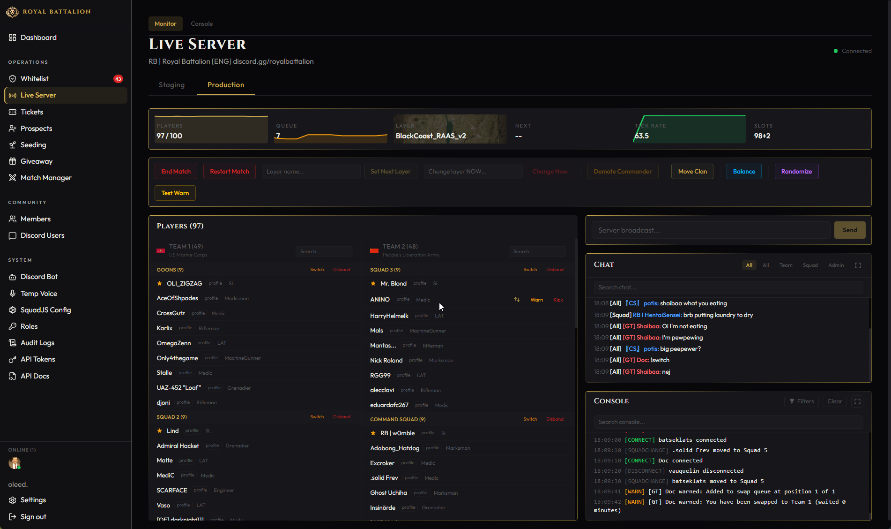
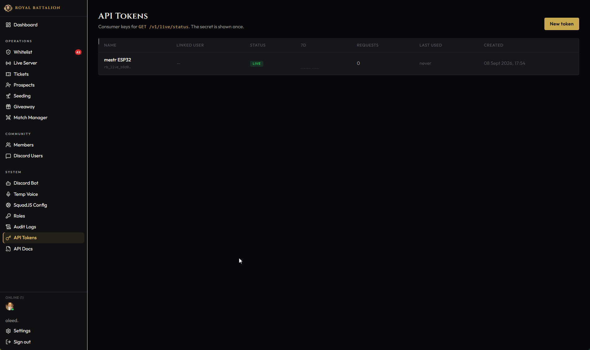
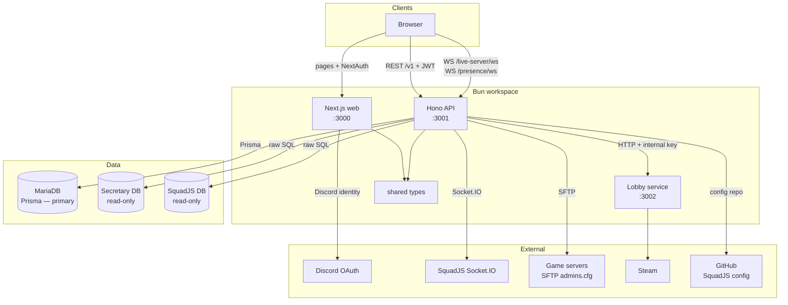
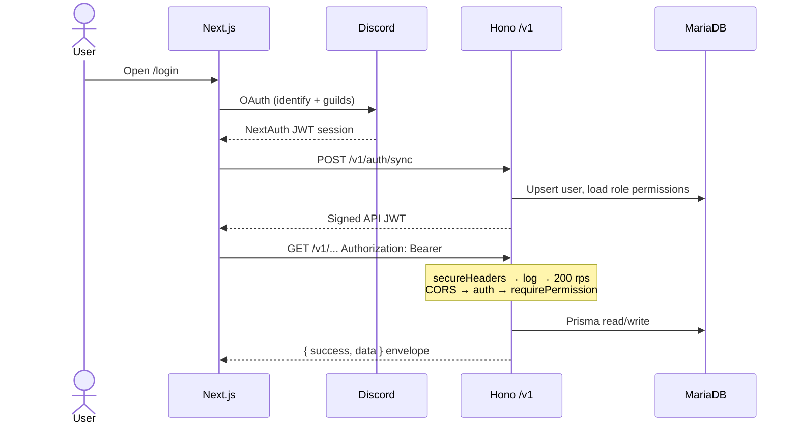

# Royal Battalion Webpage

**Live ops, whitelist, and community tools for a Squad battalion — in one dashboard.**

Public site and staff dashboard for [Royal Battalion](https://royalbattalion.xyz): Discord login, live server relay, whitelist deploy, tickets, prospects, and match history.

[](https://github.com/oleedv/RoyalBattalionWebpage)
[](https://bun.sh)
[](https://nextjs.org)
[](https://react.dev)
[](https://hono.dev)
[](https://www.prisma.io)
[](https://mariadb.org)
[](https://tailwindcss.com)
[](https://www.typescriptlang.org)
[](https://www.docker.com)
[](LICENSE)

---

## Overview

This is a Bun workspace with four packages:

| Package | Role | Port |
| --- | --- | --- |
| `packages/web` | Next.js 15 App Router — public pages, Discord OAuth, staff dashboard | `3000` |
| `packages/api` | Hono REST (`/v1`) + WebSocket relay — Prisma, SquadJS, SFTP | `3001` |
| `packages/lobby-service` | Steam lobby discovery via `steam-user` | `3002` |
| `packages/shared` | Shared TypeScript types, permission literals, country data | — |

The web app signs staff in with Discord (NextAuth). After login it exchanges that identity for an API JWT. From there the dashboard talks to Hono over REST and two WebSocket endpoints: live game events and admin presence.

Persistent data owned by this app lives in MariaDB (`prisma/schema.prisma`). The API also **reads** two other databases it does not own: the Discord secretary bot DB (tickets, prospects, messages) and the SquadJS DB (matches, playtime, connections).

Production: [royalbattalion.xyz](https://royalbattalion.xyz) · staging: [stg.royalbattalion.xyz](https://stg.royalbattalion.xyz)

---

## Screenshots

**Live server** — player roster, chat, console, and match controls.



**API tokens** — consumer keys for `GET /v1/live/status`.



---

## Architecture



### Request flow



REST lives under `/v1`. These stay unversioned on purpose: `GET /health`, `GET /live-server/health`, `GET /admins.cfg` (IP-allowlisted, `text/plain`), and the WebSocket upgrades.

Interactive API docs: `/api-docs` in the running web app (permission `view:api-docs`). Spec: [`openapi.yaml`](openapi.yaml).

---

## Prerequisites

- [Bun](https://bun.sh/) (latest)
- MariaDB 10.11+ (schema is pushed on first run)
- A [Discord application](https://discord.com/developers/applications) with OAuth2 redirect `http://localhost:3000/api/auth/callback/discord`

Optional — leave the matching env vars empty to skip:

- SquadJS Socket.IO servers (live server page has no upstream)
- SFTP target (whitelist deploy fails fast)
- GitHub token (SquadJS config editor is read-only)
- Lobby service / Steam refresh token (lobby monitor is empty)
- Secretary + SquadJS database URLs (those admin views stay empty)

---

## Installation

```bash
git clone https://github.com/oleedv/RoyalBattalionWebpage.git
cd RoyalBattalionWebpage

bun install
cp .env.example .env
# fill DATABASE_URL, JWT_SECRET, Discord OAuth, NEXTAUTH_*

bun run db:push    # create/update the primary schema
bun run dev        # web + api + lobby-service in parallel
```

| Service | URL |
| --- | --- |
| Web | http://localhost:3000 |
| API | http://localhost:3001 |
| Lobby | http://localhost:3002 |

### Environment

All packages read `.env` at the repo root.

| Group | Variable | Purpose |
| --- | --- | --- |
| Database | `DATABASE_URL` | Primary MariaDB (Prisma, required) |
| | `SECRETARY_DATABASE_URL` | Read-only secretary bot DB |
| | `SQUADJS_DATABASE_URL` | Read-only SquadJS DB |
| Discord | `DISCORD_CLIENT_ID` / `DISCORD_CLIENT_SECRET` | OAuth2 |
| | `DISCORD_GUILD_ID` | Guild membership gates login |
| | `DISCORD_BOT_TOKEN` | Background role sync |
| | `DISCORD_MEMBER_ROLE_IDS` | Comma-separated member role IDs |
| NextAuth | `NEXTAUTH_URL` | Public web URL |
| | `NEXTAUTH_SECRET` | Session signing secret |
| API | `JWT_SECRET` | API JWT signing (required) |
| | `NEXT_PUBLIC_API_URL` | Browser-facing API origin (defaults to `http://localhost:3001`) |
| SFTP | `SFTP_HOST` `SFTP_PORT` `SFTP_USER` `SFTP_PASS` `SFTP_PATH` | Default `admins.cfg` deploy (per-server overrides in `ServerConfig`) |
| | `CFG_ALLOWED_IPS` | Allowlist for `GET /admins.cfg` |
| GitHub | `GITHUB_CONFIG_TOKEN` | SquadJS config repo |
| SquadJS | `SQUADJS_SERVERS` | `name\|url\|token,name\|url\|token` |
| Lobby | `LOBBY_SERVICE_URL` `LOBBY_INTERNAL_KEY` `STEAM_REFRESH_TOKEN` | Internal lobby proxy |

---

## Usage

### Scripts

| Command | What it does |
| --- | --- |
| `bun run dev` | Start every workspace package |
| `bun run dev:web` | Next.js only (Turbopack) |
| `bun run dev:api` | Hono API only (`bun --watch`) |
| `bun run build` | Build every package |
| `bun run db:generate` | Prisma client → `packages/api/src/generated/prisma/` |
| `bun run db:push` | Sync schema to MariaDB (local + Docker entrypoint) |
| `bun run db:migrate` | Named migration for a real schema change |
| `bun run db:studio` | Prisma Studio |
| `bun test` | Colocated `*.test.ts` files |

### Health check

```bash
curl http://localhost:3001/health
curl http://localhost:3001/live-server/health
```

### Exchange Discord identity for an API JWT

After signing in at `/login`, the dashboard posts the Discord OAuth access token. The API fetches the Discord user, upserts them, loads role permissions, and returns a JWT (4h):

```bash
curl -X POST http://localhost:3001/v1/auth/sync \
  -H "Content-Type: application/json" \
  -d '{"accessToken": "<discord-oauth-access-token>"}'
```

Successful responses use the shared envelope:

```json
{
  "success": true,
  "data": {
    "token": "<api-jwt>",
    "permissions": ["view:whitelist"],
    "user": { "id": "...", "discordId": "...", "discordName": "officer" }
  }
}
```

Errors include `ACCOUNT_DISABLED` and `NOT_IN_GUILD` (HTTP 403).

### Call a protected route

```bash
curl http://localhost:3001/v1/whitelist \
  -H "Authorization: Bearer <api-jwt>"
```

Create a whitelist entry (requires `manage:whitelist`):

```bash
curl -X POST http://localhost:3001/v1/whitelist \
  -H "Authorization: Bearer <api-jwt>" \
  -H "Content-Type: application/json" \
  -d '{
    "steamId": "76561198000000000",
    "name": "PlayerName",
    "groupId": "<admin-group-id>",
    "server": "main"
  }'
```

### Live server WebSocket

Browsers cannot set headers on an upgrade, so the JWT is a query param:

```javascript
const ws = new WebSocket(
  "ws://localhost:3001/live-server/ws?server=production&token=" + apiJwt
);

ws.onmessage = (event) => {
  const msg = JSON.parse(event.data);
  // PLAYER_CONNECTED, PLAYER_DISCONNECTED, CHAT_MESSAGE,
  // NEW_GAME, ROUND_ENDED, PLAYER_DIED, TEAMKILL, ...
  console.log(msg.type, msg);
};
```

Presence (who is on which admin page) is `GET /presence/ws?page=/whitelist&token=<jwt>`.

### Public `admins.cfg`

Game servers pull this URL. It is IP-restricted via `CFG_ALLOWED_IPS` and is not JWT-authenticated.

```bash
curl "http://localhost:3001/admins.cfg?server=production"
```

---

## Tech stack

| Layer | Choice | Why it is here |
| --- | --- | --- |
| Runtime | Bun | Workspace installs, watch, tests, API process |
| Frontend | Next.js 15, React 19, App Router | Public site + authenticated dashboard |
| Styling | Tailwind CSS v4 | Utility styling, no separate CSS pipeline |
| Web auth | NextAuth 4 + Discord provider | Guild-gated staff login |
| API | Hono 4 | Small, fast REST + Bun WebSockets |
| Validation | Zod + `@hono/zod-validator` | Env and request bodies |
| JWT | jose | Sign/verify across Next and Hono |
| ORM | Prisma 7 + MariaDB adapter | Primary schema |
| Logging | Pino | Structured JSON (easy to ship to Loki) |
| Live data | `socket.io-client` | Upstream SquadJS events |
| Deploy | `ssh2-sftp-client` | Push generated `admins.cfg` |
| Steam | `steam-user` | Lobby discovery |
| API docs | `swagger-ui-react` + OpenAPI | In-app `/api-docs` |
| Deploy target | Docker on Railway | One container per package |

Permissions are a flat list of string literals in `packages/shared/types/roles.ts`. Discord roles own sets of them; a user inherits the union. `developer` bypasses checks. Route handlers gate with `requirePermission("manage:whitelist")` and similar.

---

## Project structure

```
packages/
  web/                 Next.js frontend
    app/(auth)/        Login, signout
    app/(public)/      Home, server, matches, prospect/ticket forms
    app/(protected)/   Dashboard, whitelist, live-server, tickets,
                       prospects, giveaway, discord-bot, temp-voice, ...
    lib/api-client.ts  Typed /v1 client
  api/
    src/index.ts       Middleware chain, /v1 mounts, WS upgrades
    src/routes/        One module per resource
    src/middleware/    auth, permissions, rate-limit, request-log
    src/lib/           Prisma, Discord, SFTP, SquadJS socket, cfg generator
    src/ws/            live-server + presence relays
  lobby-service/       Steam lobby HTTP surface
  shared/              types, PERMISSIONS, countries
prisma/schema.prisma   Primary database
openapi.yaml           REST contract
```

---

## Deployment

Each package is its own container. Railway builds from `packages/{web,api,lobby-service}/railway.json` (`restartPolicyType: ON_FAILURE`, 10 retries). A push to `main` deploys.

| Service | Image | Health |
| --- | --- | --- |
| Web | `packages/web/Dockerfile` — Next.js standalone on Node 22 Alpine | `/` |
| API | `packages/api/Dockerfile` — Bun. `entrypoint.sh` runs `prisma db push` then the server | `/health` |
| Lobby | `packages/lobby-service/Dockerfile` — Bun, no database | — |

---

## How to contribute

1. Branch from `main`. Use a focused name (`feat/…`, `fix/…`).
2. Keep the change to one concern. Shared types go in `packages/shared` first, then API, then web.
3. Add or update colocated `*.test.ts` files for logic that can run without Discord/MariaDB.
4. Run what you touched:

```bash
bun test
bun run build
```

5. Commit with [Conventional Commits](https://www.conventionalcommits.org/) as a one-liner, no AI attribution:

```
feat(whitelist): persist request dismissals for 30 days
fix(presence): scope online-user tooltip to avatar hover
```

Types: `feat`, `fix`, `docs`, `style`, `refactor`, `perf`, `test`, `build`, `ci`, `chore`.

6. Open a pull request against `main`. Describe the user-visible change and any env or permission additions.

New API routes belong under `/v1`, go through `success()` / `fail()`, and need a matching OpenAPI path. New staff pages need a nav entry in `packages/web/components/shell/nav-config.ts` and a permission in `PERMISSIONS`.

---

## Security

Please do not file public issues for vulnerabilities. See [SECURITY.md](SECURITY.md).

---

## License

Released under the [MIT License](LICENSE). Copyright (c) 2026 Ole Nørholm.

You may use, copy, modify, merge, publish, distribute, sublicense, and/or sell copies of this software, provided the copyright notice and permission notice are included in all copies or substantial portions. The software is provided "as is", without warranty.
